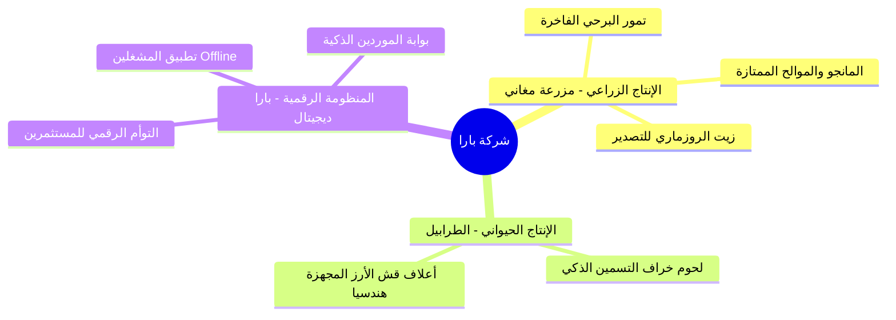

# وثيقة الهوية البصرية والتوجه الاستراتيجي | شركة بارا (Bara Brand Brief)

تحدد هذه الوثيقة الأطر العامة والمبادئ التوجيهية للعلامة التجارية لـ **شركة بارا للإنتاج الحيواني والزراعي والداجني**، لتكون المرجع الأساسي لكافة المواد التسويقية، والمراسلات الرسمية، وتصميمات واجهات المستخدم للمنظومات الرقمية التابعة للمشروع.

---

## 🎯 1. جوهر وفلسفة العلامة (Brand Core & Vision)

| الركن | الوصف الاستراتيجي |
| :--- | :--- |
| **الرؤية (Vision)** | ريادة الاستثمار الزراعي المستدام في مصر، وإرساء معايير جديدة للإنتاج الحيواني والزراعي العضوي القائم على التكنولوجيا، والوصول بالمنتج المصري الفاخر إلى الأسواق العالمية. |
| **الرسالة (Mission)** | دمج علوم الهندسة والرفع المساحي والذكاء الاصطناعي مع تقنيات التشغيل الميداني لإنتاج غذاء صحي آمن (لحوم خراف بلدية، تمور برحي فاخرة، زيوت عطرية) مع ترشيد استخدام المياه وإدارة الموارد بحرفية كاملة. |
| **شعار الشركة المقترح** | *"تكنولوجيا الأرض.. ريادة النماء"* |

---

## 💎 2. القيم الأساسية للعلامة التجارية (Core Values)

* **الرشادة البيئية (Eco-Efficiency)**: نلتزم بالري الحديث ثنائي الخطوط وتدابير منع تسرب المياه في أحواض التخزين كواجب بيئي ووطني أولاً.
* **الشفافية الرقمية (Digital Transparency)**: توفير "توأم رقمي" وحسابات دقيقة للمستثمرين يضمن الثقة المطلقة والمتابعة التشغيلية الفورية من أي مكان في العالم.
* **الالتزام بالجودة (Premium Quality)**: منتجاتنا خالية من مسرعات النمو الهرمونية أو المبيدات الضارة، وتخضع لرقابة جودة صارمة من الحقل إلى المستهلك.

---

## 🎨 3. الهوية البصرية ونظام الألوان (Visual Identity & Color System)

تم اختيار الألوان لتعبر عن التلاحم بين الطبيعة المعطاءة والتكنولوجيا الرقمية المنظمة:

```
██████████  الأخضر الغاباتي العميق (Forest Green - #0D5C3A): يمثل الأرض، الخصوبة، والزراعة العضوية.
██████████  الأصفر الذهبي الدافئ (Golden Harvest - #D4AF37): يمثل النخيل البرحي، ثمار الحمضيات والزيتون، وأشعة الشمس الاستوائية.
██████████  الرمادي الفحمي الداكن (Slate Gray - #0F1C15): يرمز للمنظومة البرمجية وقواعد البيانات والتصميمات الهندسية.
```

### 🔤 الخطوط المعتمدة (Typography)
* **العناوين الرئيسية والفرعية**: خط **Cairo** (أوزان 900 و 700) لقوته وملاءمته التامة للغة العربية الرقمية والقراءة السريعة على الشاشات.
* **النصوص الطويلة والأرقام**: خط **Cairo** (أوزان 400 و 300) لضمان انسيابية القراءة والوضوح في جداول البيانات المالية.

---

## 📢 4. نبرة صوت العلامة وأسلوب الخطاب (Brand Voice & Tone)

* **علمي وموثوق**: نتحدث بلغة الأرقام، المقايسات الميدانية، والتقارير الموثقة. لا نعتمد على العشوائية بل على لوحات التحكم والرفع المساحي.
* **طموح ووطني**: نفخر بجذورنا المصرية وقدرتنا على تصدير أفضل المنتجات الغذائية والزيوت العطرية إلى العالم.
* **ميسر ومباشر**: في واجهاتنا وتطبيقاتنا التشغيلية، نبتعد عن المصطلحات المعقدة لنسهل عمل المشغل الميداني والمستثمر على حد سواء.

---

## 🚜 5. التموضع الاستراتيجي للقطاعات الرئيسية



### 🌾 قطاع الإنتاج الزراعي (مزرعة مغاني)
* **المفهوم**: زراعة ذكية وتكثيف زراعي متطور (زراعة بينية للنخيل والروزماري) لتعظيم إنتاجية الفدان وتصدير الزيوت العطرية الفاخرة.

### 🐑 قطاع الإنتاج الحيواني (مشروع الطرابيل)
* **المفهوم**: دورات تسمين خراف بلدية تراقب نموها حساسات إنترنت الأشياء والـ RFID لضمان معامل تحويل علف مثالي ولحوم بأعلى مستويات الجودة التشغيلية والغذائية.
